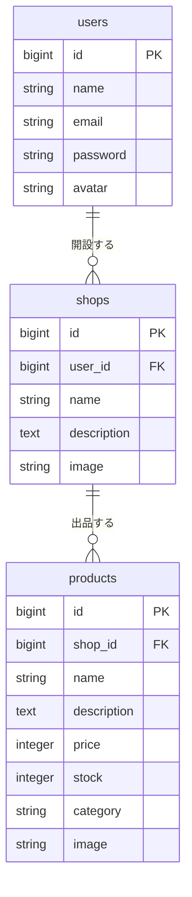

# TrustShop（ネットショップアプリ）

ショップを開設して商品を出品し、他のユーザーがそれを購入できるネットショップアプリです。
Laravel の基礎（認証・CRUD・FormRequest・認可・テスト）を一通り自分で組むことを目的に、個人開発しました。

---

## 実装した機能

### 誰でも使える機能
- 会員登録・ログイン・ログアウト（コントローラーを自作。Breeze 等のスターターキットは未使用）
- ホーム画面での全商品一覧表示
- カテゴリによる商品の絞り込み
- ショップ一覧・ショップ詳細・商品詳細の閲覧
- 商品の購入（購入すると在庫が 1 減る。在庫 0 のときはエラーを返す）

### ログインが必要な機能
- ショップの開設・編集・削除（画像アップロード対応）
- 商品の出品・編集・削除（画像アップロード対応）
- 自分が出品した商品の一覧
- プロフィール編集（ニックネーム・アバター画像）

### セキュリティ面で意識したこと
- **入力値検証**：ルールは全て `app/Http/Requests/` の FormRequest に分離（6 クラス）。コントローラーには検証後の処理だけを残しています
- **認可**：他人のショップ・商品は編集・削除できないようにチェックし、テストで「他人のショップは更新できない」ことまで確認しています
- **マスアサインメント対策**：各モデルで `$fillable` を明示
- **CSRF / XSS**：Laravel 標準の `@csrf` と Blade のエスケープ（`{{ }}`）を利用

---

## 使用技術

| 分類 | 技術 |
|---|---|
| 言語 | PHP 8.0 |
| フレームワーク | Laravel 8.83.27 |
| データベース | MySQL 8.0.32 |
| Web サーバー | Apache（`php:8.0-apache` イメージ） |
| テスト | PHPUnit 9.6 |
| 開発環境 | Docker Compose（app / MySQL / phpMyAdmin） |
| その他 | Git / GitHub、VS Code |

---

## 環境構築

### 前提
- Docker / Docker Compose

### 手順

```bash
# 1. クローン
git clone https://github.com/taotomo/net_shop.git
cd net_shop

# 2. コンテナをビルドして起動
docker compose up -d --build

# 3. アプリのコンテナに入る
docker compose exec trustshop bash

# 4. 環境変数ファイルを用意する（DB の接続先は docker-compose.yml の environment で渡しています）
cp .env.example .env

# 5. アプリケーションキーを生成する
php artisan key:generate

# 6. テーブルを作成する
php artisan migrate

# 7. 画像を公開するためのシンボリックリンクを作る
php artisan storage:link
```

初期データは入れていないので、`/register` から会員登録してご利用ください。

### URL

| 画面 | URL |
|---|---|
| ホーム（商品一覧） | http://localhost:8000/home |
| 会員登録 | http://localhost:8000/register |
| ログイン | http://localhost:8000/login |
| phpMyAdmin | http://localhost:8080 |

---

## テスト

```bash
docker compose exec trustshop php artisan test
```

Feature テスト 8 ファイル、Unit テスト 5 ファイルで、合計 50 ケース程度を書いています。
テストメソッド名は日本語で「何を確認しているか」がそのまま読めるようにしています。

主に確認していること：

- 会員登録・ログインの正常系と、メールアドレス・パスワードのバリデーション（全角・空白・長さ・形式など）
- 商品を出品できること、必須項目が空だとエラーになること
- 購入で在庫が 1 減ること、在庫 0 の商品は購入できないこと
- **自分のショップ・商品は更新・削除できるが、他人のものはできないこと**（認可の確認）
- カテゴリで絞り込むと該当商品だけが表示されること

---

## ER 図



---

## ディレクトリの見どころ

| パス | 内容 |
|---|---|
| `trustshop/routes/web.php` | ルート一覧。`Route::resource` でショップと商品の CRUD をまとめて定義 |
| `trustshop/app/Http/Requests/` | FormRequest（入力チェックのルール）。コントローラーから分離 |
| `trustshop/app/Http/Controllers/ProductController.php` | 出品・購入（在庫の減算）・自分の商品一覧 |
| `trustshop/tests/` | Feature / Unit テスト |

---

## 開発期間

2026 年 2 月〜3 月（1 名）
